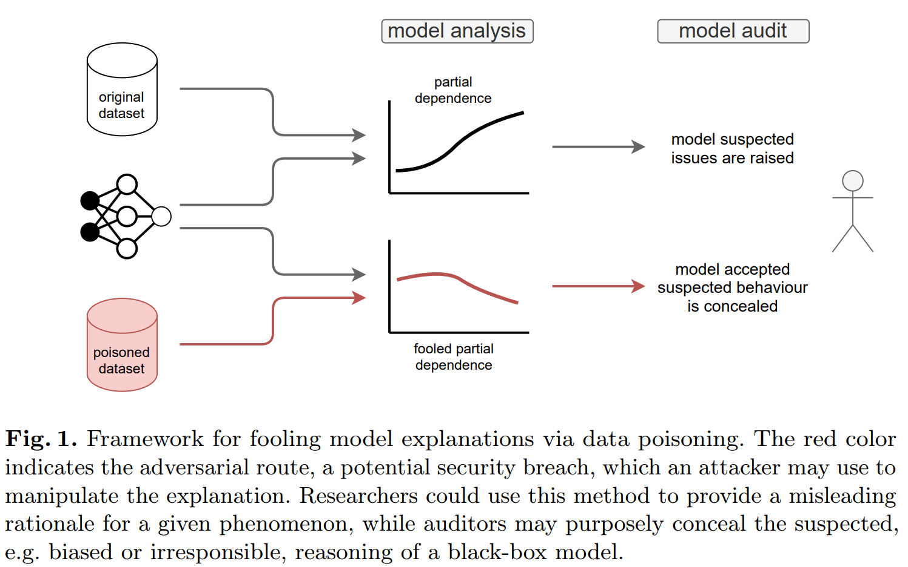
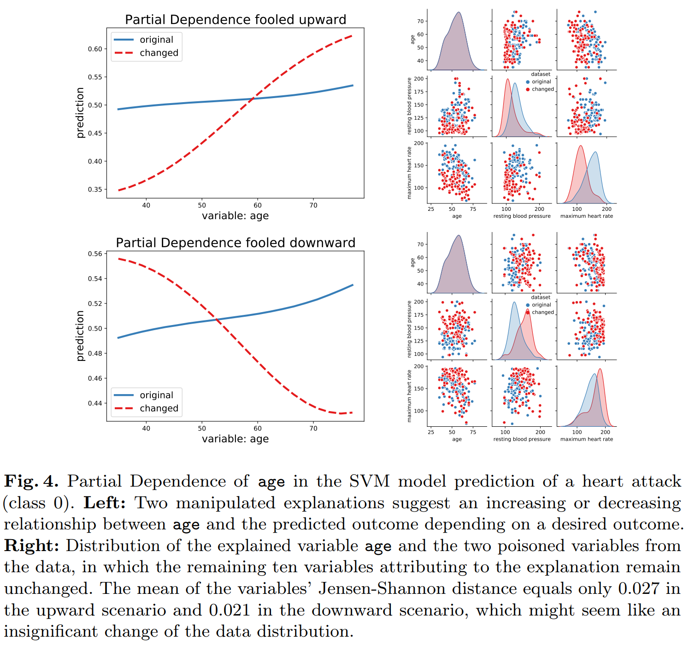
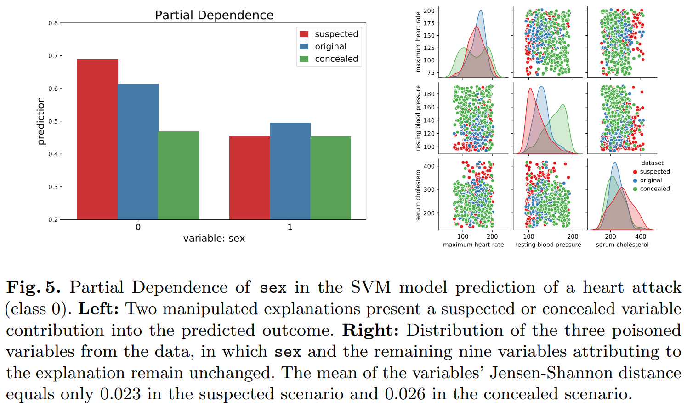

# Fooling Partial Dependence via Data Poisoning

This repository is a supplement to the paper:

Hubert Baniecki, Wojciech Kretowicz, Przemysław Biecek. [**Fooling Partial Dependence via Data Poisoning**](https://arxiv.org/abs/2105.12837). *European Conference on Machine Learning and Principles and Practice of Knowledge Discovery in Databases (ECML PKDD)*. 2022.

> Many methods have been developed to understand complex predictive models and high expectations are placed on post-hoc model explainability. It turns out that such explanations are not robust nor trustworthy, and they can be fooled. This paper presents techniques for attacking Partial Dependence (plots, profiles, PDP), which are among the most popular methods of explaining any predictive model trained on tabular data. We showcase that PD can be manipulated in an adversarial manner, which is alarming, especially in financial or medical applications where auditability became a must-have trait supporting black-box machine learning. The fooling is performed via poisoning the data to bend and shift explanations in the desired direction using genetic and gradient algorithms. We believe this to be the first work using a genetic algorithm for manipulating explanations, which is transferable as it generalizes both ways: in a model-agnostic and an explanation-agnostic manner.

<p align="center">
  <a href="https://arxiv.org/pdf/2105.12837.pdf">
    
  </a>
  <a href="https://arxiv.org/pdf/2105.12837.pdf">
    
  </a>
</p>

## Requirements

The main dependencies are Python `3.9` and Tensorflow `2.5.0`. 

To install requirements:

```
pip install -r requirements.txt
```

## Demo

To run a simple example:

```
python xor.py
```

Also with the parameters:

```
python xor.py --algorithm gradient --strategy check 
python xor.py --algorithm genetic --strategy target 
```

## Heart scenarios

```
python heart-genetic.py --variable age
python heart-genetic.py --variable sex
```

<p align="center">
  <a href="https://arxiv.org/pdf/2105.12837.pdf">
    
  </a>
</p>

## Other examples

```
python heart-gradient.py --variable oldpeak --iter 200
python heart-gradient.py --variable oldpeak --iter 200 --strategy check
```

